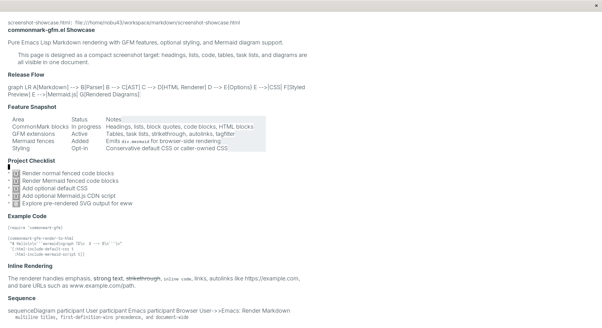
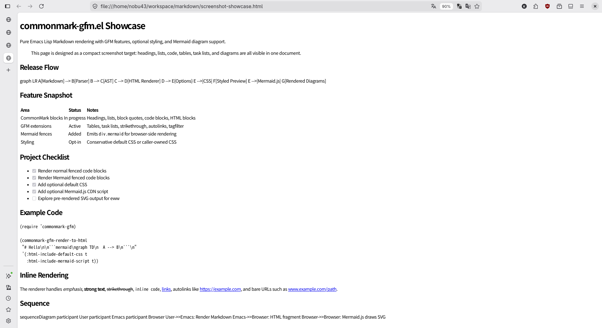
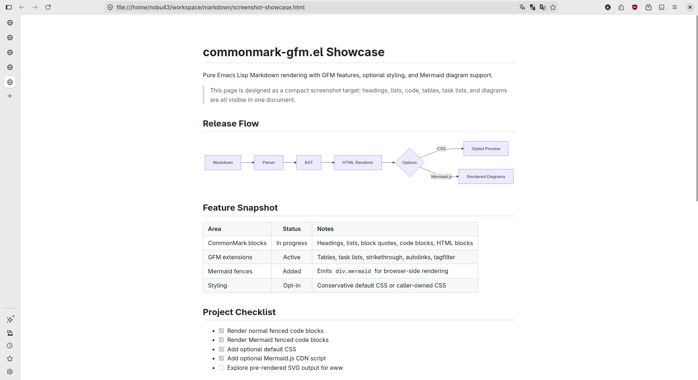

#+title: commonmark-gfm.el

Pure Emacs Lisp CommonMark/GFM renderer for Emacs.

~commonmark-gfm.el~ parses Markdown into a small AST and renders it to HTML
without calling an external Markdown command.  It can be used directly from
Emacs Lisp or installed as a ~markdown-command~ compatible renderer for
packages such as ~markdown-mode~.

The implementation focuses on CommonMark-compatible rendering first, with GFM
extensions enabled by default for practical GitHub-style Markdown documents.

* Status

The CommonMark mode currently passes all 652 official CommonMark 0.31.2
examples used by the bundled spec runner.  GFM support is usable for common
documents, but the project still treats full GFM compatibility as active work
until the upstream cmark-gfm fixture is tracked in CI.

It currently provides:

- An AST shape for block and inline nodes.
- A growing block parser for headings, thematic breaks, block quotes, lists,
  code blocks, HTML blocks, raw HTML, and GFM tables.
- Block parsing includes CommonMark-oriented block quote lazy continuation,
  tab-aware container indentation, fenced-code indentation, and loose/tight
  list paragraph rendering.
- A small bootstrap inline parser for escapes, code spans, emphasis, strong
  emphasis, links, images, reference links, character references, autolinks,
  hard breaks, GFM strikethrough, GFM bare autolinks, and GFM tagfilter.
- CommonMark mode can be selected with ~(:gfm nil)~; this is the mode used
  when checking the official CommonMark examples.
- The bundled ~make check~ suite now includes a focused GFM smoke fixture for
  tables, task lists, strikethrough, autolink literals, and tagfilter.
- CommonMark-style link reference definitions, including multiline labels,
  multiline titles, first-definition-wins precedence, and document-wide
  references discovered in basic containers.
- Emphasis parsing uses CommonMark-style flanking checks for ~*~ and ~_~,
  skips code/link/html/autolink spans while scanning for closers, and handles
  balanced long delimiter runs, but it is not yet a full delimiter stack
  implementation.
- An HTML renderer.
- A ~markdown-command~ compatible function.
- An ERT bridge for CommonMark/GFM JSON spec examples and cmark-gfm
  side-by-side ~spec.txt~ examples.
- Local cmark-gfm ~spec.txt~ measurement currently reaches 672/672 using
  ~commonmark-gfm-spec-gfm-options~, which checks the base examples and GFM
  extension examples with the render mode expected by the cmark-gfm spec text.
- Source positions on parsed block nodes and paragraph/heading inline spans
  using ~((start-line start-column) (end-line end-column))~.

The public API is still small and intentionally conservative so the parser can
keep improving without forcing downstream users to change entry points.

* Screenshots

** markdown-live-preview-mode (eww)
:PROPERTIES:
:ID:       91d7f28b-e4f0-4fa5-9544-3eac3075bc49
:END:


#+DOWNLOADED: screenshot @ 2026-06-26 07:20:27


** html
:PROPERTIES:
:ID:       acef68e9-79f7-4f3b-ab12-dde76df9d978
:END:


#+DOWNLOADED: screenshot @ 2026-06-26 07:22:54


** html (css + mermaid)
:PROPERTIES:
:ID:       8233371f-7e95-4c22-8adb-35661386f5fa
:END:

#+DOWNLOADED: screenshot @ 2026-06-26 07:28:00


* Usage

Add this directory to ~load-path~, then:

#+begin_src elisp
  (require 'commonmark-gfm)

  (setq markdown-command #'commonmark-gfm-markdown-command)
  (setq markdown-command-needs-filename nil)
  ;; (setq commonmark-gfm-html-include-default-css t)
  ;; (setq commonmark-gfm-html-include-mermaid-script t)
#+end_src

Or call:

#+begin_src elisp
  (commonmark-gfm-use-as-markdown-command)
#+end_src

Programmatic rendering:

#+begin_src elisp
  (commonmark-gfm-render-to-html "# Hello\n")

  ;; Disable GFM extensions when checking pure CommonMark behavior.
  (commonmark-gfm-render-to-html "https://example.com\n" '(:gfm nil))

  ;; Include the conservative default CSS in the returned HTML fragment.
  (commonmark-gfm-render-to-html "# Hello\n" '(:html-include-default-css t))

  ;; Or provide caller-owned CSS without enabling the default CSS.
  (commonmark-gfm-render-to-html "# Hello\n" '(:html-user-css "h1 { color: red; }"))

  ;; Include Mermaid.js from the configured CDN for browser-side diagram rendering.
  (commonmark-gfm-render-to-html
   "```mermaid\ngraph TD\n  A --> B\n```\n"
   '(:html-include-mermaid-script t))
#+end_src

* Current Scope

Good fits today:

- Rendering Markdown buffers to HTML inside Emacs.
- Using a pure Emacs Lisp fallback when an external ~markdown-command~ is not
  desirable.
- Testing CommonMark/GFM behavior from Emacs Lisp with ERT.
- Experimenting with Markdown AST processing in Emacs Lisp.

Still being hardened:

- Full GFM compatibility against the upstream cmark-gfm fixture in CI.
- Exact source columns for every nested container and inline edge case.
- Replacing the remaining bootstrap inline parser pieces with a full
  CommonMark delimiter stack implementation.

* Development

Run the smoke tests and byte compilation:

#+begin_src sh
  make check
#+end_src

Run only ERT:

#+begin_src sh
  make test
#+end_src

Run the bundled JSON spec smoke fixture:

#+begin_src sh
  make spec
#+end_src

Run the bundled GFM extension smoke fixture:

#+begin_src sh
  make gfm-spec
#+end_src

Run another CommonMark-style JSON spec file and get pass/fail counts:

#+begin_src sh
  make spec SPEC=/path/to/spec.json
#+end_src

~SPEC~ may also point at cmark-gfm's side-by-side ~spec.txt~ format for a
single render mode.  To measure cmark-gfm's full spec text with GFM extension
examples enabled and CommonMark examples checked in CommonMark mode:

#+begin_src sh
  make gfm-full-spec GFM_FULL_SPEC=/path/to/cmark-gfm/test/spec.txt
#+end_src

Or from Emacs Lisp:

#+begin_src elisp
  (commonmark-gfm-spec-report-file "/path/to/spec.json")

  ;; cmark-gfm spec.txt with GFM extension examples enabled.
  (commonmark-gfm-spec-run-file
   "/path/to/cmark-gfm/test/spec.txt"
   #'commonmark-gfm-spec-gfm-options)
#+end_src

* Compatibility Roadmap

1. Add the official GFM spec fixture or fetch step and track the full GFM pass
   count in CI.
2. Extend source positions to exact columns for nested containers, GFM table
   cells, and every remaining inline edge case.
3. Replace the remaining bootstrap inline parser pieces with a full delimiter
   stack implementation rather than the current compatibility-oriented
   recursive scanner.
4. Finish any remaining GFM extension edge cases discovered by the official
   fixture.
5. Use ~cmark-gfm~ only as a development oracle, not as a runtime dependency.

* License

The Emacs Lisp implementation is released under the MIT License.  See
~LICENSE~.

Some test cases and smoke fixtures include Markdown input and expected HTML
adapted from the CommonMark and GitHub Flavored Markdown specifications.  Those
specification-derived examples remain under their original specification
licenses, primarily Creative Commons Attribution-ShareAlike 4.0 International.
See ~NOTICE~ and ~test/README.md~ for attribution and details.

The full upstream CommonMark/GFM spec files are not vendored in this
repository.  ~make gfm-full-spec~ expects a local external copy of cmark-gfm's
~test/spec.txt~.

* Public API

- ~commonmark-gfm-parse~
- ~commonmark-gfm-render-to-html~
- ~commonmark-gfm-render-region-to-buffer~
- ~commonmark-gfm-markdown-command~
- ~commonmark-gfm-use-as-markdown-command~
- ~commonmark-gfm-spec-run-file~
- ~commonmark-gfm-spec-report-file~
- ~commonmark-gfm-spec-define-tests~
